# Core Lending Loan Servicing Microservice

[](https://opensource.org/licenses/Apache-2.0)
[](https://openjdk.java.net/projects/jdk/21/)
[](https://spring.io/projects/spring-boot)

## Overview

The **Core Lending Loan Servicing Microservice** is a critical component of the **Firefly OpenCore Banking Platform**, developed by **Firefly Software Solutions Inc** under the Apache 2.0 license. This microservice is responsible for comprehensive loan servicing operations after loan origination and disbursement.

This service provides a complete loan lifecycle management system, handling everything from disbursements and repayment schedules to interest accruals, rate changes, and servicing events. It's designed with reactive programming principles using Spring WebFlux and R2DBC for high-performance, non-blocking operations.

**Organization**: [firefly-oss](https://github.com/firefly-oss)
**Website**: [getfirefly.io](https://getfirefly.io)
**License**: Apache 2.0

## Architecture

The microservice follows a clean, modular architecture with clear separation of concerns across multiple Maven modules:

### Module Structure

- **`core-lending-loan-servicing-interfaces`**: Contains DTOs, interfaces, enums, and API contracts
- **`core-lending-loan-servicing-models`**: Contains JPA entities, repositories, and database migrations
- **`core-lending-loan-servicing-core`**: Contains business logic, service implementations, and mappers
- **`core-lending-loan-servicing-web`**: Contains REST controllers, web configuration, and application entry point
- **`core-lending-loan-servicing-sdk`**: Contains generated client SDK for external integrations

### Core Capabilities

- **Loan Servicing Case Management**: Central management of loan servicing lifecycle
- **Disbursement Tracking**: Complete disbursement history and final disbursement tracking
- **Installment Management**: Planned installments and actual payment records with internal/external payment tracking
- **Interest & Fee Accruals**: Automated calculation and tracking of interest, penalties, and fees
- **Rate Change Management**: Interest rate adjustments with full audit trail
- **Servicing Events**: Comprehensive event tracking for restructures, extensions, and collections

## Technology Stack

- **Java 21**: Latest LTS version with virtual threads support
- **Spring Boot 3.x**: Modern Spring framework with native compilation support
- **Spring WebFlux**: Reactive web framework for non-blocking I/O
- **R2DBC**: Reactive database connectivity for PostgreSQL
- **PostgreSQL**: Primary database with advanced features
- **Flyway**: Database migration and versioning
- **Maven**: Build automation and dependency management
- **OpenAPI 3**: API documentation and client generation
- **MapStruct**: Type-safe bean mapping
- **Lombok**: Boilerplate code reduction
- **Docker**: Containerization and deployment

## Data Model

The microservice manages a comprehensive loan servicing data model with the following core entities:

### Entity Relationship Diagram

```mermaid
erDiagram
    LoanServicingCase ||--o{ LoanDisbursement : "has many"
    LoanServicingCase ||--o{ LoanInstallmentPlan : "has many"
    LoanServicingCase ||--o{ LoanInstallmentRecord : "has many"
    LoanServicingCase ||--o{ LoanAccrual : "has many"
    LoanServicingCase ||--o{ LoanRateChange : "has many"
    LoanServicingCase ||--o{ LoanServicingEvent : "has many"
    LoanInstallmentPlan ||--o{ LoanInstallmentRecord : "linked to"
    LoanDisbursement ||--o{ LoanDisbursementInternalTransaction : "has many"
    LoanDisbursement ||--o{ LoanDisbursementExternalTransaction : "has many"
    LoanInstallmentRecord ||--o{ LoanInstallmentRecordInternalTransaction : "has many"
    LoanInstallmentRecord ||--o{ LoanInstallmentRecordExternalTransaction : "has many"

    LoanServicingCase {
        UUID loan_servicing_case_id PK
        UUID contract_id FK "Reference to loan contract"
        UUID product_id FK "Reference to loan product"
        UUID application_id FK "Reference to loan application (origination)"
        ServicingStatusEnum servicing_status "ACTIVE, PAID_OFF, CLOSED, DEFAULT, RESTRUCTURED"
        DECIMAL principal_outstanding "Outstanding principal amount"
        DECIMAL interest_outstanding "Outstanding interest amount"
        DECIMAL fees_outstanding "Outstanding fees amount"
        DATE origination_date "Loan origination date"
        DATE maturity_date "Loan maturity date"
        TEXT remarks "Additional notes"
        TIMESTAMP created_at
        TIMESTAMP updated_at
    }

    LoanDisbursement {
        UUID loan_disbursement_id PK
        UUID loan_servicing_case_id FK
        UUID transaction_id FK "Reference to transaction"
        DECIMAL disbursement_amount "Amount disbursed"
        DATE disbursement_date "Date of disbursement"
        BOOLEAN is_final_disbursement "Final disbursement flag"
        DisbursementMethodEnum disbursement_method "INTERNAL, EXTERNAL"
        DisbursementStatusEnum disbursement_status "PENDING, PROCESSING, COMPLETED, FAILED, REVERSED"
        UUID payment_provider_id "Reference to PSP master data"
        VARCHAR external_transaction_reference "PSP transaction reference"
        TEXT note "Disbursement notes"
        TIMESTAMP created_at
        TIMESTAMP updated_at
    }

    LoanInstallmentPlan {
        UUID loan_installment_plan_id PK
        UUID loan_servicing_case_id FK
        INTEGER installment_number "Installment sequence number"
        DATE due_date "Payment due date"
        DECIMAL principal_due "Principal amount due"
        DECIMAL interest_due "Interest amount due"
        DECIMAL fee_due "Fee amount due"
        DECIMAL total_due "Total amount due"
        BOOLEAN is_paid "Payment status"
        DATE paid_date "Date payment was made"
        DECIMAL paid_amount "Amount actually paid"
        PaymentMethodEnum payment_method "INTERNAL or EXTERNAL"
        UUID payment_account_id "Optional: Customer internal account (INTERNAL only)"
        UUID payment_provider_id "Optional: PSP reference (EXTERNAL only)"
        STRING external_account_reference "Optional: External account identifier"
        BOOLEAN is_automatic_payment "Automatic payment flag"
        TIMESTAMP created_at
        TIMESTAMP updated_at
    }

    LoanInstallmentRecord {
        UUID loan_installment_record_id PK
        UUID loan_servicing_case_id FK
        UUID loan_installment_plan_id FK "Optional link to plan"
        UUID transaction_id FK "Reference to transaction"
        DECIMAL payment_amount "Payment amount"
        DATE payment_date "Date of payment"
        BOOLEAN is_partial_payment "Partial payment flag"
        PaymentMethodEnum payment_method "INTERNAL or EXTERNAL"
        PaymentStatusEnum payment_status "PENDING, PROCESSING, COMPLETED, FAILED, REVERSED"
        UUID payment_provider_id "Optional: PSP reference (EXTERNAL only)"
        STRING external_transaction_reference "External PSP transaction reference"
        TEXT note "Payment notes"
        TIMESTAMP created_at
        TIMESTAMP updated_at
    }

    LoanInstallmentRecordInternalTransaction {
        UUID loan_installment_record_internal_transaction_id PK
        UUID loan_installment_record_id FK
        UUID source_account_id "Customer internal account"
        UUID destination_account_id "Loan internal account"
        DECIMAL transaction_amount
        STRING transaction_reference
        TIMESTAMP transaction_date
        TEXT note
        TIMESTAMP created_at
        TIMESTAMP updated_at
    }

    LoanInstallmentRecordExternalTransaction {
        UUID loan_installment_record_external_transaction_id PK
        UUID loan_installment_record_id FK
        UUID payment_provider_id "PSP reference"
        STRING psp_transaction_id "PSP transaction ID"
        STRING psp_transaction_reference "PSP reference"
        DECIMAL transaction_amount
        STRING transaction_currency "ISO currency code"
        STRING psp_status "PSP status"
        TEXT psp_status_message
        STRING payer_account_number "Customer external account"
        STRING payer_name "Customer name"
        TIMESTAMP transaction_date
        TEXT psp_response_payload "Full PSP response"
        TEXT note
        TIMESTAMP created_at
        TIMESTAMP updated_at
    }

    LoanAccrual {
        UUID loan_accrual_id PK
        UUID loan_servicing_case_id FK
        DECIMAL accrual_amount "Accrued amount"
        AccrualTypeEnum accrual_type "INTEREST, PENALTY, LATE_FEE, SERVICING_FEE"
        DATE accrual_date "Date of accrual"
        TEXT note "Accrual notes"
        TIMESTAMP created_at
        TIMESTAMP updated_at
    }

    LoanRateChange {
        UUID loan_rate_change_id PK
        UUID loan_servicing_case_id FK
        DECIMAL old_interest_rate "Previous interest rate"
        DECIMAL new_interest_rate "New interest rate"
        DATE effective_date "Rate change effective date"
        ReasonCodeEnum reason_code "INDEX_ADJUSTMENT, RENEGOTIATION, PENALTY, PROMOTION"
        TEXT note "Rate change notes"
        TIMESTAMP created_at
        TIMESTAMP updated_at
    }

    LoanServicingEvent {
        UUID loan_servicing_event_id PK
        UUID loan_servicing_case_id FK
        EventTypeEnum event_type "RESTRUCTURE, EXTENSION, DEFERMENT, COLLECTION_CALL, NOTICE"
        DATE event_date "Date of event"
        TEXT description "Event description"
        TIMESTAMP created_at
        TIMESTAMP updated_at
    }

    LoanDisbursementInternalTransaction {
        UUID loan_disbursement_internal_transaction_id PK
        UUID loan_disbursement_id FK
        UUID source_account_id "Source account for transfer"
        UUID destination_account_id "Destination account for transfer"
        DECIMAL transaction_amount "Transaction amount"
        VARCHAR transaction_reference "Internal transaction reference"
        TIMESTAMP transaction_date "Date of transaction"
        TEXT note "Transaction notes"
        TIMESTAMP created_at
        TIMESTAMP updated_at
    }

    LoanDisbursementExternalTransaction {
        UUID loan_disbursement_external_transaction_id PK
        UUID loan_disbursement_id FK
        UUID payment_provider_id "Reference to PSP master data"
        VARCHAR psp_transaction_id "PSP transaction ID"
        VARCHAR psp_transaction_reference "PSP transaction reference"
        DECIMAL transaction_amount "Transaction amount"
        VARCHAR transaction_currency "ISO currency code"
        VARCHAR psp_status "Status from PSP"
        TEXT psp_status_message "Status message from PSP"
        VARCHAR recipient_account_number "Recipient account"
        VARCHAR recipient_name "Recipient name"
        TIMESTAMP transaction_date "Date of transaction"
        TEXT psp_response_payload "Full PSP response for audit"
        TEXT note "Transaction notes"
        TIMESTAMP created_at
        TIMESTAMP updated_at
    }
```



### Decoupled Architecture

The microservice is **completely decoupled from the internal account system**, enabling lending products for any customer:

#### **Key Design Principles**

1. **No Account Dependency**
   - `LoanServicingCase` references `applicationId` (from loan origination), NOT `accountId`
   - Customers do NOT need an internal account to receive a loan
   - Payment collection is configured per installment, not per customer

2. **Flexible Payment Collection**
   - Each `LoanInstallmentPlan` specifies its own payment method (INTERNAL or EXTERNAL)
   - Supports mixed payment methods within the same loan (e.g., first payment internal, rest external)

#### **Payment Methods**

1. **INTERNAL Payments** (Customer has internal account)
   - Payment is debited from customer's internal account
   - `LoanInstallmentPlan.paymentAccountId` references the customer's internal account
   - `LoanInstallmentRecordInternalTransaction` tracks the account-to-account movement
   - Both `sourceAccountId` (customer) and `destinationAccountId` (loan) are internal

2. **EXTERNAL Payments** (Customer has NO internal account)
   - Payment is collected via external Payment Service Provider (PSP)
   - `LoanInstallmentPlan.paymentProviderId` references the PSP (e.g., Stripe, PayPal)
   - `LoanInstallmentPlan.externalAccountReference` stores customer's external account identifier
   - `LoanInstallmentRecordExternalTransaction` tracks PSP transaction details
   - Supports direct debit from external bank accounts, credit cards, etc.

#### **Use Cases**

- **Internal Customer**: Customer has a checking account with the bank → Use INTERNAL payment method
- **External Customer**: Customer banks elsewhere → Use EXTERNAL payment method with PSP
- **Mixed Portfolio**: Some customers internal, some external → Each installment plan configured independently
- **Loan Tracking**: All loans trace back to their originating `applicationId` for complete audit trail

This architecture ensures the loan servicing system can provide lending products to **any customer**, regardless of whether they have an internal account relationship.

## Prerequisites

- **Java Development Kit (JDK) 21** or higher
- **Maven 3.8+** for build management
- **PostgreSQL 13+** for database
- **Docker** (optional, for containerized deployment)
- **Git** for version control

## Setup and Installation

### Local Development

1. **Clone the repository:**
   ```bash
   git clone git@github.com:firefly-oss/core-lending-loan-servicing.git
   cd core-lending-loan-servicing
   ```

2. **Set up environment variables:**
   ```bash
   export DB_HOST=localhost
   export DB_PORT=5432
   export DB_NAME=loan_servicing
   export DB_USERNAME=your_username
   export DB_PASSWORD=your_password
   export DB_SSL_MODE=disable
   ```

3. **Build the project:**
   ```bash
   mvn clean install
   ```

4. **Run the application:**
   ```bash
   mvn spring-boot:run -pl core-lending-loan-servicing-web
   ```

5. **Access the application:**
   - Application: http://localhost:8080
   - API Documentation: http://localhost:8080/swagger-ui.html
   - Health Check: http://localhost:8080/actuator/health

### Docker Deployment

1. **Build the application:**
   ```bash
   mvn clean package
   ```

2. **Build Docker image:**
   ```bash
   docker build -t firefly/core-lending-loan-servicing:latest .
   ```

3. **Run with Docker Compose:**
   ```bash
   docker-compose up -d
   ```

## API Documentation

The microservice provides comprehensive REST APIs documented with OpenAPI 3.0:

- **Local Environment**: http://localhost:8080/swagger-ui.html
- **Development Environment**: http://core.getfirefly.io/loan-servicing/swagger-ui.html

### API Endpoints Overview

| Resource | Base Path | Description |
|----------|-----------|-------------|
| Loan Servicing Cases | `/api/v1/loan-servicing-cases` | Main loan servicing case management |
| Disbursements | `/api/v1/loan-servicing-cases/{caseId}/disbursements` | Loan disbursement operations |
| Installment Plans | `/api/v1/loan-servicing-cases/{caseId}/installment-plans` | Planned installment schedule management |
| Installment Records | `/api/v1/loan-servicing-cases/{caseId}/installment-records` | Actual payment tracking (internal/external) |
| Accruals | `/api/v1/loan-servicing-cases/{caseId}/accruals` | Interest and fee accruals |
| Rate Changes | `/api/v1/loan-servicing-cases/{caseId}/rate-changes` | Interest rate modifications |
| Servicing Events | `/api/v1/loan-servicing-cases/{caseId}/events` | Loan servicing event tracking |

## Development Guidelines

### Project Structure

The microservice follows a clean architecture pattern with clear module boundaries:

```
core-lending-loan-servicing/
├── core-lending-loan-servicing-interfaces/    # DTOs, Enums, API Contracts
│   ├── src/main/java/.../dtos/                # Data Transfer Objects
│   ├── src/main/java/.../enums/               # Enumeration types
│   └── src/test/java/.../validation/          # DTO validation tests
├── core-lending-loan-servicing-models/        # Entities, Repositories, Migrations
│   ├── src/main/java/.../entities/            # JPA entities
│   ├── src/main/java/.../repositories/        # R2DBC repositories
│   └── src/main/resources/db/migration/       # Flyway migrations
├── core-lending-loan-servicing-core/          # Business Logic, Services
│   ├── src/main/java/.../services/            # Service implementations
│   ├── src/main/java/.../mappers/             # MapStruct mappers
│   └── src/test/java/.../services/            # Service tests
├── core-lending-loan-servicing-web/           # REST Controllers, Configuration
│   ├── src/main/java/.../controllers/         # REST endpoints
│   ├── src/main/java/.../config/              # Spring configuration
│   ├── src/main/resources/application.yaml    # Application configuration
│   └── src/test/java/.../controllers/         # Controller tests
└── core-lending-loan-servicing-sdk/           # Generated Client SDK
    └── src/gen/java/                          # Generated client code
```

### Coding Standards

- **Java 21 Features**: Utilize modern Java features including virtual threads, pattern matching, and records
- **Reactive Programming**: Use Project Reactor for non-blocking, asynchronous operations
- **Validation**: All DTOs include comprehensive Jakarta validation annotations
- **Documentation**: Document all public APIs with OpenAPI 3.0 annotations
- **Testing**: Maintain high test coverage with unit and integration tests
- **Code Quality**: Follow Google Java Style Guide and use static analysis tools

### Database Guidelines

- **Migrations**: All schema changes must be versioned using Flyway migrations
- **UUIDs**: Use UUID primary keys for all entities for better distributed system support
- **Enums**: Database enums are mapped to Java enums with automatic casting
- **Auditing**: All entities include `created_at` and `updated_at` timestamps

## Testing

### Running Tests

```bash
# Run all tests
mvn clean test

# Run tests for specific module
mvn test -pl core-lending-loan-servicing-core

# Run integration tests
mvn verify

# Run tests with coverage
mvn clean test jacoco:report
```

### Test Categories

- **Unit Tests**: Fast, isolated tests for business logic
- **Integration Tests**: Database and API integration tests
- **Validation Tests**: DTO validation constraint tests
- **Contract Tests**: API contract verification

## Configuration

### Application Properties

Key configuration properties in `application.yaml`:

```yaml
spring:
  application:
    name: core-lending-loan-servicing
    version: 1.0.0
  r2dbc:
    url: r2dbc:postgresql://${DB_HOST}:${DB_PORT}/${DB_NAME}
  flyway:
    enabled: true
    locations: classpath:db/migration
```

### Environment Variables

| Variable | Description | Default |
|----------|-------------|---------|
| `DB_HOST` | Database host | `localhost` |
| `DB_PORT` | Database port | `5432` |
| `DB_NAME` | Database name | `loan_servicing` |
| `DB_USERNAME` | Database username | - |
| `DB_PASSWORD` | Database password | - |
| `DB_SSL_MODE` | SSL mode | `disable` |
| `SERVER_PORT` | Application port | `8080` |

## Monitoring and Observability

### Health Checks

- **Liveness**: `/actuator/health/liveness`
- **Readiness**: `/actuator/health/readiness`
- **General Health**: `/actuator/health`

### Metrics

- **Prometheus**: `/actuator/prometheus`
- **Application Info**: `/actuator/info`

## Deployment

### Development Environment

The service is deployed in the development environment at:
- **Base URL**: http://core.getfirefly.io/loan-servicing
- **API Docs**: http://core.getfirefly.io/loan-servicing/swagger-ui.html

### Production Deployment

For production deployment:

1. **Build the application:**
   ```bash
   mvn clean package -Pprod
   ```

2. **Deploy using Docker:**
   ```bash
   docker run -d \
     --name loan-servicing \
     -p 8080:8080 \
     -e DB_HOST=prod-db-host \
     -e DB_USERNAME=prod-user \
     -e DB_PASSWORD=prod-password \
     firefly/core-lending-loan-servicing:latest
   ```

## Contributing

We welcome contributions to the Firefly OpenCore Banking Platform! Please follow these guidelines:

### Development Workflow

1. **Fork the repository** from [firefly-oss/core-lending-loan-servicing](https://github.com/firefly-oss/core-lending-loan-servicing)
2. **Create a feature branch** from `main`:
   ```bash
   git checkout -b feature/your-feature-name
   ```
3. **Implement your changes** following the coding standards
4. **Write comprehensive tests** for your changes
5. **Ensure all tests pass**:
   ```bash
   mvn clean verify
   ```
6. **Submit a pull request** with a clear description of changes

### Code Review Process

- All changes require review from at least one maintainer
- Automated CI/CD checks must pass
- Code coverage should not decrease
- Documentation must be updated for API changes

## License

This project is licensed under the **Apache License 2.0** - see the [LICENSE](LICENSE) file for details.

```
Copyright 2024 Firefly Software Solutions Inc

Licensed under the Apache License, Version 2.0 (the "License");
you may not use this file except in compliance with the License.
You may obtain a copy of the License at

    http://www.apache.org/licenses/LICENSE-2.0

Unless required by applicable law or agreed to in writing, software
distributed under the License is distributed on an "AS IS" BASIS,
WITHOUT WARRANTIES OR CONDITIONS OF ANY KIND, either express or implied.
See the License for the specific language governing permissions and
limitations under the License.
```

## Support and Contact

- **Website**: [getfirefly.io](https://getfirefly.io)
- **GitHub Organization**: [firefly-oss](https://github.com/firefly-oss)
- **Documentation**: [docs.getfirefly.io](https://docs.getfirefly.io)
- **Community**: [community.getfirefly.io](https://community.getfirefly.io)

---

**Firefly OpenCore Banking Platform** - Building the future of open banking infrastructure.