# Core Lending Loan Servicing Microservice

[](https://opensource.org/licenses/Apache-2.0)
[](https://openjdk.java.net/projects/jdk/25/)
[](https://spring.io/projects/spring-boot)

## Overview

The **Core Lending Loan Servicing Microservice** is a critical component of the **Firefly OpenCore Banking Platform**, developed by **Firefly Software Solutions Inc** under the Apache 2.0 license. This microservice is responsible for comprehensive loan servicing operations after loan origination and disbursement.

This service provides a complete loan lifecycle management system, handling everything from disbursements and repayment schedules to interest accruals, rate changes, and servicing events. It's designed with reactive programming principles using Spring WebFlux and R2DBC for high-performance, non-blocking operations.

**Organization**: [firefly-oss](https://github.com/firefly-oss)
**Website**: [getfirefly.io](https://getfirefly.io)
**License**: Apache 2.0

## Architecture

The microservice follows a clean, modular architecture with clear separation of concerns across multiple Maven modules:

### Module Structure

- **`core-lending-loan-servicing-interfaces`**: Contains DTOs, interfaces, enums, and API contracts
- **`core-lending-loan-servicing-models`**: Contains JPA entities, repositories, and database migrations
- **`core-lending-loan-servicing-core`**: Contains business logic, service implementations, and mappers
- **`core-lending-loan-servicing-web`**: Contains REST controllers, web configuration, and application entry point
- **`core-lending-loan-servicing-sdk`**: Contains generated client SDK for external integrations

### Core Capabilities

- **Loan Servicing Case Management**: Central management of loan servicing lifecycle with comprehensive configuration
- **Disbursement Planning & Tracking**: Staged disbursement schedules for construction loans and line of credit draws
- **Installment Management**: Planned installments and actual payment records with internal/external payment tracking
- **Balance Tracking**: Historical balance snapshots with principal, interest, and fees outstanding
- **Interest & Fee Accruals**: Automated calculation and tracking of interest, penalties, and fees
- **Rate Change Management**: Interest rate adjustments with full audit trail
- **Loan Restructuring**: Complete restructuring history with old/new terms comparison
- **Escrow Management**: Comprehensive escrow accounts for all lending products (insurance, taxes, reserves, fees, trade finance, construction)
- **Rebate Processing**: Borrower rebates, distributor commissions, and promotional incentives
- **Notification System**: Multi-channel notifications to loan parties (email, SMS, push, in-app, mail, phone)
- **Servicing Events**: Comprehensive event tracking for restructures, extensions, and collections

## Technology Stack

- **Java 25**: Latest LTS version with virtual threads support
- **Spring Boot 3.x**: Modern Spring framework with native compilation support
- **Spring WebFlux**: Reactive web framework for non-blocking I/O
- **R2DBC**: Reactive database connectivity for PostgreSQL
- **PostgreSQL**: Primary database with advanced features
- **Flyway**: Database migration and versioning
- **Maven**: Build automation and dependency management
- **OpenAPI 3**: API documentation and client generation
- **MapStruct**: Type-safe bean mapping
- **Lombok**: Boilerplate code reduction
- **Docker**: Containerization and deployment

## Data Model

The microservice manages a comprehensive loan servicing data model with the following core entities:

### Entity Relationship Diagram

```mermaid
erDiagram
    LoanServicingCase ||--o{ LoanDisbursement : "has many"
    LoanServicingCase ||--o{ LoanDisbursementPlan : "has many"
    LoanServicingCase ||--o{ LoanInstallmentPlan : "has many"
    LoanServicingCase ||--o{ LoanInstallmentRecord : "has many"
    LoanServicingCase ||--o{ LoanRepaymentSchedule : "has many"
    LoanServicingCase ||--o{ LoanRepaymentRecord : "has many"
    LoanServicingCase ||--o{ LoanBalance : "has many"
    LoanServicingCase ||--o{ LoanAccrual : "has many"
    LoanServicingCase ||--o{ LoanRateChange : "has many"
    LoanServicingCase ||--o{ LoanRestructuring : "has many"
    LoanServicingCase ||--o{ LoanEscrow : "has many"
    LoanServicingCase ||--o{ LoanRebate : "has many"
    LoanServicingCase ||--o{ LoanNotification : "has many"
    LoanServicingCase ||--o{ LoanServicingEvent : "has many"
    LoanInstallmentPlan ||--o{ LoanInstallmentRecord : "linked to"
    LoanRepaymentSchedule ||--o{ LoanRepaymentRecord : "linked to"
    LoanDisbursement ||--o{ LoanDisbursementInternalTransaction : "has many"
    LoanDisbursement ||--o{ LoanDisbursementExternalTransaction : "has many"
    LoanInstallmentRecord ||--o{ LoanInstallmentRecordInternalTransaction : "has many"
    LoanInstallmentRecord ||--o{ LoanInstallmentRecordExternalTransaction : "has many"

    LoanServicingCase {
        UUID loan_servicing_case_id PK
        UUID contract_id FK "Reference to loan contract"
        UUID product_id FK "Reference to loan product"
        UUID application_id FK "Reference to loan application (origination)"
        UUID proposed_offer_id FK "Reference to accepted proposed offer (origination)"
        UUID product_catalog_id FK "Reference to product category/template"
        ServicingStatusEnum servicing_status "Status: PENDING, ACTIVE, GRACE_PERIOD, DELINQUENT, DEFAULT, etc."
        DECIMAL principal_amount "Original principal amount"
        DECIMAL interest_rate "Annual interest rate percentage"
        INTEGER loan_term "Loan term in payment periods"
        InterestCalculationMethodEnum interest_calculation_method "SIMPLE, COMPOUND, ACTUARIAL, REDUCING_BALANCE, FLAT_RATE"
        AmortizationMethodEnum amortization_method "EQUAL_INSTALLMENT, EQUAL_PRINCIPAL, BALLOON_PAYMENT, INTEREST_ONLY, BULLET"
        PaymentFrequencyEnum payment_frequency "DAILY, WEEKLY, BIWEEKLY, SEMIMONTHLY, MONTHLY, BIMONTHLY, QUARTERLY, SEMIANNUALLY, ANNUALLY"
        CompoundingFrequencyEnum compounding_frequency "DAILY, MONTHLY, QUARTERLY, SEMIANNUALLY, ANNUALLY, CONTINUOUS"
        DayCountConventionEnum day_count_convention "ACTUAL_360, ACTUAL_365, ACTUAL_ACTUAL, THIRTY_360"
        DATE origination_date "Loan origination date"
        DATE maturity_date "Loan maturity date"
        TEXT remarks "Additional notes"
        TIMESTAMP created_at
        TIMESTAMP updated_at
    }

    LoanDisbursement {
        UUID loan_disbursement_id PK
        UUID loan_servicing_case_id FK
        UUID transaction_id FK "Reference to transaction"
        DECIMAL disbursement_amount "Amount disbursed"
        DATE disbursement_date "Date of disbursement"
        BOOLEAN is_final_disbursement "Final disbursement flag"
        DisbursementMethodEnum disbursement_method "INTERNAL, EXTERNAL"
        DisbursementStatusEnum disbursement_status "PENDING, PROCESSING, COMPLETED, FAILED, REVERSED"
        UUID payment_provider_id "Reference to PSP master data"
        UUID distributor_id "Reference to distributor (from distributor microservice)"
        UUID distributor_agency_id "Reference to distributor agency"
        UUID distributor_agent_id "Reference to distributor agent"
        VARCHAR external_transaction_reference "PSP transaction reference"
        TEXT note "Disbursement notes"
        TIMESTAMP created_at
        TIMESTAMP updated_at
    }

    LoanDisbursementPlan {
        UUID loan_disbursement_plan_id PK
        UUID loan_servicing_case_id FK
        DATE planned_disbursement_date "Planned disbursement date"
        DECIMAL planned_amount "Planned disbursement amount"
        DATE actual_disbursement_date "Actual disbursement date"
        DECIMAL actual_amount "Actual disbursement amount"
        INTEGER disbursement_number "Sequence number (1st, 2nd, 3rd, etc.)"
        BOOLEAN is_completed "Completion status"
        VARCHAR purpose "Purpose of disbursement (e.g., Foundation, Framing)"
        TEXT remarks "Additional notes"
        TIMESTAMP created_at
        TIMESTAMP updated_at
    }

    LoanInstallmentPlan {
        UUID loan_installment_plan_id PK
        UUID loan_servicing_case_id FK
        INTEGER installment_number "Installment sequence number"
        DATE due_date "Payment due date"
        DECIMAL principal_due "Principal amount due"
        DECIMAL interest_due "Interest amount due"
        DECIMAL fee_due "Fee amount due"
        DECIMAL total_due "Total amount due"
        BOOLEAN is_paid "Payment status"
        DATE paid_date "Date payment was made"
        DECIMAL paid_amount "Amount actually paid"
        PaymentMethodEnum payment_method "INTERNAL or EXTERNAL"
        UUID payment_account_id "Optional: Customer internal account (INTERNAL only)"
        UUID payment_provider_id "Optional: PSP reference (EXTERNAL only)"
        STRING external_account_reference "Optional: External account identifier"
        BOOLEAN is_automatic_payment "Automatic payment flag"
        TIMESTAMP created_at
        TIMESTAMP updated_at
    }

    LoanInstallmentRecord {
        UUID loan_installment_record_id PK
        UUID loan_servicing_case_id FK
        UUID loan_installment_plan_id FK "Optional link to plan"
        UUID transaction_id FK "Reference to transaction"
        DECIMAL payment_amount "Payment amount"
        DATE payment_date "Date of payment"
        BOOLEAN is_partial_payment "Partial payment flag"
        PaymentMethodEnum payment_method "INTERNAL or EXTERNAL"
        PaymentStatusEnum payment_status "PENDING, PROCESSING, COMPLETED, FAILED, REVERSED"
        UUID payment_provider_id "Optional: PSP reference (EXTERNAL only)"
        STRING external_transaction_reference "External PSP transaction reference"
        TEXT note "Payment notes"
        TIMESTAMP created_at
        TIMESTAMP updated_at
    }

    LoanRepaymentSchedule {
        UUID loan_repayment_schedule_id PK
        UUID loan_servicing_case_id FK
        INTEGER installment_number "Installment sequence number"
        DATE due_date "Payment due date"
        DECIMAL principal_due "Principal amount due"
        DECIMAL interest_due "Interest amount due"
        DECIMAL fee_due "Fee amount due"
        DECIMAL total_due "Total amount due"
        BOOLEAN is_paid "Payment status"
        DATE paid_date "Date payment was made"
        DECIMAL paid_amount "Amount actually paid"
        TIMESTAMP created_at
        TIMESTAMP updated_at
    }

    LoanRepaymentRecord {
        UUID loan_repayment_record_id PK
        UUID loan_servicing_case_id FK
        UUID loan_repayment_schedule_id FK "Optional link to schedule"
        UUID transaction_id FK "Reference to transaction"
        DECIMAL payment_amount "Payment amount"
        DATE payment_date "Date of payment"
        BOOLEAN is_partial_payment "Partial payment flag"
        TEXT note "Payment notes"
        TIMESTAMP created_at
        TIMESTAMP updated_at
    }

    LoanBalance {
        UUID loan_balance_id PK
        UUID loan_servicing_case_id FK
        DECIMAL principal_outstanding "Outstanding principal amount"
        DECIMAL interest_outstanding "Outstanding interest amount"
        DECIMAL fees_outstanding "Outstanding fees amount"
        DECIMAL total_outstanding "Total outstanding balance (computed)"
        DATE balance_date "Date of balance snapshot"
        BOOLEAN is_current "True for most recent balance, false for historical"
        TIMESTAMP created_at
        TIMESTAMP updated_at
    }

    LoanInstallmentRecordInternalTransaction {
        UUID loan_installment_record_internal_transaction_id PK
        UUID loan_installment_record_id FK
        UUID source_account_id "Customer internal account"
        UUID destination_account_id "Loan internal account"
        DECIMAL transaction_amount
        STRING transaction_reference
        TIMESTAMP transaction_date
        TEXT note
        TIMESTAMP created_at
        TIMESTAMP updated_at
    }

    LoanInstallmentRecordExternalTransaction {
        UUID loan_installment_record_external_transaction_id PK
        UUID loan_installment_record_id FK
        UUID payment_provider_id "PSP reference"
        STRING psp_transaction_id "PSP transaction ID"
        STRING psp_transaction_reference "PSP reference"
        DECIMAL transaction_amount
        STRING transaction_currency "ISO currency code"
        STRING psp_status "PSP status"
        TEXT psp_status_message
        STRING payer_account_number "Customer external account"
        STRING payer_name "Customer name"
        TIMESTAMP transaction_date
        TEXT psp_response_payload "Full PSP response"
        TEXT note
        TIMESTAMP created_at
        TIMESTAMP updated_at
    }

    LoanAccrual {
        UUID loan_accrual_id PK
        UUID loan_servicing_case_id FK
        DECIMAL accrual_amount "Accrued amount"
        AccrualTypeEnum accrual_type "INTEREST, PENALTY, LATE_FEE, SERVICING_FEE"
        DATE accrual_date "Date of accrual"
        TEXT note "Accrual notes"
        TIMESTAMP created_at
        TIMESTAMP updated_at
    }

    LoanRateChange {
        UUID loan_rate_change_id PK
        UUID loan_servicing_case_id FK
        DECIMAL old_interest_rate "Previous interest rate"
        DECIMAL new_interest_rate "New interest rate"
        DATE effective_date "Rate change effective date"
        ReasonCodeEnum reason_code "INDEX_ADJUSTMENT, RENEGOTIATION, PENALTY, PROMOTION"
        TEXT note "Rate change notes"
        TIMESTAMP created_at
        TIMESTAMP updated_at
    }

    LoanRestructuring {
        UUID loan_restructuring_id PK
        UUID loan_servicing_case_id FK
        DATE restructuring_date "Date of restructuring"
        VARCHAR reason "Reason for restructuring"
        DECIMAL old_principal_amount "Original principal amount"
        DECIMAL old_interest_rate "Original interest rate"
        INTEGER old_loan_term "Original loan term"
        InterestCalculationMethodEnum old_interest_calculation_method
        AmortizationMethodEnum old_amortization_method
        PaymentFrequencyEnum old_payment_frequency
        CompoundingFrequencyEnum old_compounding_frequency
        DayCountConventionEnum old_day_count_convention
        DATE old_maturity_date "Original maturity date"
        DECIMAL new_principal_amount "New principal amount"
        DECIMAL new_interest_rate "New interest rate"
        INTEGER new_loan_term "New loan term"
        InterestCalculationMethodEnum new_interest_calculation_method
        AmortizationMethodEnum new_amortization_method
        PaymentFrequencyEnum new_payment_frequency
        CompoundingFrequencyEnum new_compounding_frequency
        DayCountConventionEnum new_day_count_convention
        DATE new_maturity_date "New maturity date"
        UUID approved_by "User who approved restructuring"
        TEXT remarks "Additional notes"
        TIMESTAMP created_at
        TIMESTAMP updated_at
    }

    LoanEscrow {
        UUID loan_escrow_id PK
        UUID loan_servicing_case_id FK
        EscrowTypeEnum escrow_type "INSURANCE, TAX, MAINTENANCE_RESERVE, FREIGHT_SHIPPING, etc."
        DECIMAL monthly_payment_amount "Monthly escrow payment amount"
        DECIMAL current_balance "Current escrow account balance"
        DECIMAL target_balance "Target/required escrow balance"
        DECIMAL annual_disbursement_amount "Expected annual disbursement"
        DATE next_disbursement_date "When next payment is due"
        DATE last_analysis_date "Last escrow analysis date"
        DATE next_analysis_date "Next scheduled escrow analysis"
        BOOLEAN is_active "Escrow account active status"
        VARCHAR payee_name "Payee name (e.g., Insurance Co, Tax Authority)"
        VARCHAR payee_account_number "Payee account number"
        TEXT remarks "Additional notes"
        TIMESTAMP created_at
        TIMESTAMP updated_at
    }

    LoanRebate {
        UUID loan_rebate_id PK
        UUID loan_servicing_case_id FK
        RebateTypeEnum rebate_type "BORROWER_REBATE, DISTRIBUTOR_COMMISSION, PROMOTIONAL_REBATE, etc."
        DECIMAL rebate_amount "Rebate amount"
        DATE rebate_date "Date rebate was issued"
        UUID distributor_id "Optional: Distributor ID (from distributor microservice)"
        UUID distributor_agency_id "Optional: Distributor agency ID"
        UUID distributor_agent_id "Optional: Distributor agent ID"
        DECIMAL distributor_commission "Optional: Commission paid to distributor"
        BOOLEAN is_processed "Processing status"
        DATE processed_date "Date rebate was processed"
        VARCHAR description "Rebate description"
        TEXT remarks "Additional notes"
        TIMESTAMP created_at
        TIMESTAMP updated_at
    }

    LoanNotification {
        UUID loan_notification_id PK
        UUID loan_servicing_case_id FK
        NotificationTypeEnum notification_type "PAYMENT_DUE_REMINDER, PAYMENT_RECEIVED, DISBURSEMENT_COMPLETED, etc."
        NotificationChannelEnum notification_channel "EMAIL, SMS, PUSH, IN_APP, MAIL, PHONE"
        NotificationStatusEnum notification_status "PENDING, SENT, DELIVERED, FAILED, READ"
        UUID recipient_party_id "Recipient party ID from application/contract"
        VARCHAR recipient_name "Recipient name"
        VARCHAR recipient_contact "Recipient contact (email, phone, etc.)"
        VARCHAR subject "Notification subject"
        TEXT message_body "Notification message content"
        TIMESTAMP scheduled_send_time "Scheduled send time"
        TIMESTAMP sent_time "Actual send time"
        TIMESTAMP delivered_time "Delivery timestamp"
        TIMESTAMP read_time "Read timestamp (for in-app notifications)"
        TEXT failure_reason "Reason if delivery failed"
        INTEGER retry_count "Number of retry attempts"
        VARCHAR template_id "Notification template ID"
        TEXT metadata "Additional metadata (JSON)"
        TIMESTAMP created_at
        TIMESTAMP updated_at
    }

    LoanServicingEvent {
        UUID loan_servicing_event_id PK
        UUID loan_servicing_case_id FK
        EventTypeEnum event_type "RESTRUCTURE, EXTENSION, DEFERMENT, COLLECTION_CALL, NOTICE"
        DATE event_date "Date of event"
        TEXT description "Event description"
        TIMESTAMP created_at
        TIMESTAMP updated_at
    }

    LoanDisbursementInternalTransaction {
        UUID loan_disbursement_internal_transaction_id PK
        UUID loan_disbursement_id FK
        UUID source_account_id "Source account for transfer"
        UUID destination_account_id "Destination account for transfer"
        DECIMAL transaction_amount "Transaction amount"
        VARCHAR transaction_reference "Internal transaction reference"
        TIMESTAMP transaction_date "Date of transaction"
        TEXT note "Transaction notes"
        TIMESTAMP created_at
        TIMESTAMP updated_at
    }

    LoanDisbursementExternalTransaction {
        UUID loan_disbursement_external_transaction_id PK
        UUID loan_disbursement_id FK
        UUID payment_provider_id "Reference to PSP master data"
        VARCHAR psp_transaction_id "PSP transaction ID"
        VARCHAR psp_transaction_reference "PSP transaction reference"
        DECIMAL transaction_amount "Transaction amount"
        VARCHAR transaction_currency "ISO currency code"
        VARCHAR psp_status "Status from PSP"
        TEXT psp_status_message "Status message from PSP"
        VARCHAR recipient_account_number "Recipient account"
        VARCHAR recipient_name "Recipient name"
        TIMESTAMP transaction_date "Date of transaction"
        TEXT psp_response_payload "Full PSP response for audit"
        TEXT note "Transaction notes"
        TIMESTAMP created_at
        TIMESTAMP updated_at
    }
```



### Decoupled Architecture

The microservice is **completely decoupled from the internal account system**, enabling lending products for any customer:

#### **Key Design Principles**

1. **No Account Dependency**
   - `LoanServicingCase` references `applicationId` (from loan origination), NOT `accountId`
   - Customers do NOT need an internal account to receive a loan
   - Payment collection is configured per installment, not per customer

2. **Flexible Payment Collection**
   - Each `LoanInstallmentPlan` specifies its own payment method (INTERNAL or EXTERNAL)
   - Supports mixed payment methods within the same loan (e.g., first payment internal, rest external)

#### **Payment Methods**

1. **INTERNAL Payments** (Customer has internal account)
   - Payment is debited from customer's internal account
   - `LoanInstallmentPlan.paymentAccountId` references the customer's internal account
   - `LoanInstallmentRecordInternalTransaction` tracks the account-to-account movement
   - Both `sourceAccountId` (customer) and `destinationAccountId` (loan) are internal

2. **EXTERNAL Payments** (Customer has NO internal account)
   - Payment is collected via external Payment Service Provider (PSP)
   - `LoanInstallmentPlan.paymentProviderId` references the PSP (e.g., Stripe, PayPal)
   - `LoanInstallmentPlan.externalAccountReference` stores customer's external account identifier
   - `LoanInstallmentRecordExternalTransaction` tracks PSP transaction details
   - Supports direct debit from external bank accounts, credit cards, etc.

#### **Use Cases**

- **Internal Customer**: Customer has a checking account with the bank → Use INTERNAL payment method
- **External Customer**: Customer banks elsewhere → Use EXTERNAL payment method with PSP
- **Mixed Portfolio**: Some customers internal, some external → Each installment plan configured independently
- **Loan Tracking**: All loans trace back to their originating `applicationId` for complete audit trail

This architecture ensures the loan servicing system can provide lending products to **any customer**, regardless of whether they have an internal account relationship.

## Entity Details

### Core Entities

#### LoanServicingCase

The central entity representing a loan servicing case with comprehensive configuration.

**Key Fields:**
- `loanServicingCaseId`: Unique identifier (UUID)
- `contractId`: Reference to the loan contract
- `productId`: Reference to the loan product
- `applicationId`: Reference to the originating loan application
- `servicingStatus`: Current status (PENDING, ACTIVE, DELINQUENT, etc.)
- `interestCalculationMethod`: How interest is calculated
- `amortizationMethod`: How the loan is amortized
- `paymentFrequency`: Payment schedule frequency
- `compoundingFrequency`: Interest compounding frequency
- `dayCountConvention`: Day count convention for interest
- `interestRate`: Annual interest rate percentage
- `loanTerm`: Loan term in months
- `principalAmount`: Original principal amount
- `originationDate`: Loan origination date
- `maturityDate`: Loan maturity date

**Relationships:**
- One-to-many with LoanDisbursement, LoanDisbursementPlan, LoanInstallmentPlan, LoanInstallmentRecord, LoanBalance, LoanAccrual, LoanRateChange, LoanRestructuring, LoanEscrow, LoanRebate, LoanNotification, LoanServicingEvent

#### LoanDisbursement

Tracks actual loan disbursements with internal/external transaction support.

**Key Fields:**
- `loanDisbursementId`: Unique identifier (UUID)
- `loanServicingCaseId`: Parent loan servicing case
- `transactionId`: Reference to transaction
- `disbursementAmount`: Amount disbursed
- `disbursementDate`: Date of disbursement
- `isFinalDisbursement`: Flag for final disbursement
- `disbursementMethod`: INTERNAL or EXTERNAL
- `disbursementStatus`: PENDING, PROCESSING, COMPLETED, FAILED, REVERSED
- `paymentProviderId`: PSP reference (for external disbursements)
- `distributorId`: Distributor ID (from distributor microservice)
- `distributorAgencyId`: Distributor agency ID
- `distributorAgentId`: Distributor agent ID
- `externalTransactionReference`: PSP transaction reference

**Relationships:**
- Many-to-one with LoanServicingCase
- One-to-many with LoanDisbursementInternalTransaction, LoanDisbursementExternalTransaction

#### LoanDisbursementPlan

Manages staged disbursement schedules for construction loans and line of credit draws.

**Key Fields:**
- `loanDisbursementPlanId`: Unique identifier (UUID)
- `loanServicingCaseId`: Parent loan servicing case
- `plannedDisbursementDate`: Planned disbursement date
- `plannedAmount`: Planned disbursement amount
- `actualDisbursementDate`: Actual disbursement date
- `actualAmount`: Actual disbursement amount
- `disbursementNumber`: Sequence number (1st, 2nd, 3rd draw)
- `isCompleted`: Completion status
- `purpose`: Purpose of disbursement (e.g., "Foundation", "Framing")

**Use Cases:**
- Construction loans with multiple draw schedules
- Line of credit disbursements
- Staged funding for business loans
- Educational loans with semester-based disbursements

#### LoanInstallmentPlan

Represents the planned installment schedule.

**Key Fields:**
- `loanInstallmentPlanId`: Unique identifier (UUID)
- `loanServicingCaseId`: Parent loan servicing case
- `installmentNumber`: Installment sequence number
- `dueDate`: Payment due date
- `principalDue`: Principal amount due
- `interestDue`: Interest amount due
- `feeDue`: Fee amount due
- `totalDue`: Total amount due
- `isPaid`: Payment status
- `paidDate`: Date payment was made
- `paidAmount`: Amount actually paid
- `paymentMethod`: INTERNAL or EXTERNAL
- `paymentAccountId`: Customer internal account (INTERNAL only)
- `paymentProviderId`: PSP reference (EXTERNAL only)
- `externalAccountReference`: External account identifier
- `isAutomaticPayment`: Automatic payment flag

**Relationships:**
- Many-to-one with LoanServicingCase
- One-to-many with LoanInstallmentRecord

#### LoanInstallmentRecord

Tracks actual payments made against installments.

**Key Fields:**
- `loanInstallmentRecordId`: Unique identifier (UUID)
- `loanServicingCaseId`: Parent loan servicing case
- `loanInstallmentPlanId`: Optional link to planned installment
- `transactionId`: Reference to transaction
- `paymentAmount`: Payment amount
- `paymentDate`: Date of payment
- `isPartialPayment`: Partial payment flag
- `paymentMethod`: INTERNAL or EXTERNAL
- `paymentStatus`: PENDING, PROCESSING, COMPLETED, FAILED, REVERSED
- `paymentProviderId`: PSP reference (EXTERNAL only)
- `externalTransactionReference`: PSP transaction reference

**Relationships:**
- Many-to-one with LoanServicingCase
- Many-to-one with LoanInstallmentPlan (optional)
- One-to-many with LoanInstallmentRecordInternalTransaction, LoanInstallmentRecordExternalTransaction

#### LoanRepaymentSchedule

Tracks the planned repayment schedule for a loan with amortization details.

**Key Fields:**
- `loanRepaymentScheduleId`: Unique identifier (UUID)
- `loanServicingCaseId`: Parent loan servicing case
- `installmentNumber`: Installment sequence number
- `dueDate`: Payment due date
- `principalDue`: Principal amount due
- `interestDue`: Interest amount due
- `feeDue`: Fee amount due
- `totalDue`: Total amount due
- `isPaid`: Payment status flag
- `paidDate`: Date payment was made
- `paidAmount`: Amount actually paid

**Use Cases:**
- Amortization schedule generation
- Payment due tracking
- Principal/interest breakdown
- Payment history tracking
- Schedule vs actual comparison

**Relationships:**
- Many-to-one with LoanServicingCase
- One-to-many with LoanRepaymentRecord

#### LoanRepaymentRecord

Tracks actual repayment transactions against the repayment schedule.

**Key Fields:**
- `loanRepaymentRecordId`: Unique identifier (UUID)
- `loanServicingCaseId`: Parent loan servicing case
- `loanRepaymentScheduleId`: Optional link to repayment schedule
- `transactionId`: Reference to transaction
- `paymentAmount`: Payment amount
- `paymentDate`: Date of payment
- `isPartialPayment`: Partial payment flag
- `note`: Payment notes

**Use Cases:**
- Repayment transaction tracking
- Payment history
- Schedule vs actual reconciliation
- Partial payment tracking
- Payment audit trail

**Relationships:**
- Many-to-one with LoanServicingCase
- Many-to-one with LoanRepaymentSchedule (optional)

#### LoanBalance

Tracks historical balance snapshots for audit and reporting.

**Key Fields:**
- `loanBalanceId`: Unique identifier (UUID)
- `loanServicingCaseId`: Parent loan servicing case
- `principalOutstanding`: Outstanding principal amount
- `interestOutstanding`: Outstanding interest amount
- `feesOutstanding`: Outstanding fees amount
- `totalOutstanding`: Total outstanding balance (computed)
- `balanceDate`: Date of balance snapshot
- `isCurrent`: True for most recent balance, false for historical

**Use Cases:**
- Historical balance tracking
- Month-end balance snapshots
- Audit trail for balance changes
- Reporting and analytics
- Point-in-time balance queries

#### LoanAccrual

Tracks interest, penalties, and fee accruals.

**Key Fields:**
- `loanAccrualId`: Unique identifier (UUID)
- `loanServicingCaseId`: Parent loan servicing case
- `accrualAmount`: Accrued amount
- `accrualType`: INTEREST, PENALTY, LATE_FEE, SERVICING_FEE
- `accrualDate`: Date of accrual

**Relationships:**
- Many-to-one with LoanServicingCase

#### LoanRateChange

Tracks interest rate changes with full audit trail.

**Key Fields:**
- `loanRateChangeId`: Unique identifier (UUID)
- `loanServicingCaseId`: Parent loan servicing case
- `oldInterestRate`: Previous interest rate
- `newInterestRate`: New interest rate
- `effectiveDate`: Rate change effective date
- `reasonCode`: INDEX_ADJUSTMENT, RENEGOTIATION, PENALTY, PROMOTION

**Relationships:**
- Many-to-one with LoanServicingCase

#### LoanRestructuring

Tracks loan restructuring events with complete old/new terms comparison.

**Key Fields:**
- `loanRestructuringId`: Unique identifier (UUID)
- `loanServicingCaseId`: Parent loan servicing case
- `restructuringDate`: Date of restructuring
- `reason`: Reason for restructuring
- **Old Terms:**
  - `oldPrincipalAmount`: Original principal amount
  - `oldInterestRate`: Original interest rate
  - `oldLoanTerm`: Original loan term
  - `oldInterestCalculationMethod`: Original interest calculation method
  - `oldAmortizationMethod`: Original amortization method
  - `oldPaymentFrequency`: Original payment frequency
  - `oldCompoundingFrequency`: Original compounding frequency
  - `oldDayCountConvention`: Original day count convention
  - `oldMaturityDate`: Original maturity date
- **New Terms:**
  - `newPrincipalAmount`: New principal amount
  - `newInterestRate`: New interest rate
  - `newLoanTerm`: New loan term
  - `newInterestCalculationMethod`: New interest calculation method
  - `newAmortizationMethod`: New amortization method
  - `newPaymentFrequency`: New payment frequency
  - `newCompoundingFrequency`: New compounding frequency
  - `newDayCountConvention`: New day count convention
  - `newMaturityDate`: New maturity date
- `approvedBy`: User ID who approved the restructuring

**Use Cases:**
- Loan modifications
- Forbearance agreements
- Workout arrangements
- Refinancing
- Complete audit trail of term changes

#### LoanEscrow

Manages escrow accounts for all types of lending products including mortgages, asset-based lending, trade finance, equipment financing, and construction loans.

**Key Fields:**
- `loanEscrowId`: Unique identifier (UUID)
- `loanServicingCaseId`: Parent loan servicing case
- `escrowType`: INSURANCE, TAX, MAINTENANCE_RESERVE, FREIGHT_SHIPPING, DEBT_SERVICE_RESERVE, etc.
- `monthlyPaymentAmount`: Monthly escrow payment amount
- `currentBalance`: Current escrow account balance
- `targetBalance`: Target/required escrow balance
- `annualDisbursementAmount`: Expected annual disbursement (e.g., annual tax bill)
- `nextDisbursementDate`: When next payment is due (e.g., tax due date)
- `lastAnalysisDate`: Last escrow analysis date
- `nextAnalysisDate`: Next scheduled escrow analysis
- `isActive`: Escrow account active status
- `payeeName`: Payee name (e.g., "Insurance Company", "Tax Authority", "Freight Forwarder")
- `payeeAccountNumber`: Payee account number

**Use Cases:**
- **Mortgages**: Property tax, homeowners insurance, mortgage insurance, HOA fees
- **Asset-Based Lending**: Collateral insurance, inventory monitoring, appraisal fees
- **Trade Finance**: Freight/shipping costs, warehousing fees, LC fees, import/export duties
- **Equipment Financing**: Equipment insurance, maintenance reserves, operating expenses
- **Construction Loans**: Construction holdback, performance bonds, retainage
- **Project Finance**: Debt service reserves, interest reserves, contingency reserves
- **General Lending**: Legal fees, regulatory compliance, environmental compliance

#### LoanRebate

Tracks rebates, commissions, and incentives.

**Key Fields:**
- `loanRebateId`: Unique identifier (UUID)
- `loanServicingCaseId`: Parent loan servicing case
- `rebateType`: BORROWER_REBATE, DISTRIBUTOR_COMMISSION, PROMOTIONAL_REBATE, etc.
- `rebateAmount`: Rebate amount
- `rebateDate`: Date rebate was issued
- `distributorId`: Distributor ID (from distributor microservice) - optional
- `distributorAgencyId`: Distributor agency ID - optional
- `distributorAgentId`: Distributor agent ID - optional
- `distributorCommission`: Commission paid to distributor (optional)
- `isProcessed`: Processing status
- `processedDate`: Date rebate was processed
- `description`: Rebate description

**Use Cases:**
- Direct borrower rebates
- Distributor/broker commissions
- Promotional incentives
- Early payment rebates
- Loyalty program rebates
- Referral rebates
- Government subsidies
- Rate buydowns
- Closing cost rebates
- Volume rebates

#### LoanNotification

Tracks notifications sent to loan parties via multiple channels.

**Key Fields:**
- `loanNotificationId`: Unique identifier (UUID)
- `loanServicingCaseId`: Parent loan servicing case
- `notificationType`: PAYMENT_DUE_REMINDER, PAYMENT_RECEIVED, DISBURSEMENT_COMPLETED, etc.
- `notificationChannel`: EMAIL, SMS, PUSH, IN_APP, MAIL, PHONE
- `notificationStatus`: PENDING, SENT, DELIVERED, FAILED, READ
- `recipientPartyId`: Recipient party ID from application/contract
- `recipientName`: Recipient name
- `recipientContact`: Recipient contact (email, phone, etc.)
- `subject`: Notification subject
- `messageBody`: Notification message content
- `scheduledSendTime`: Scheduled send time
- `sentTime`: Actual send time
- `deliveredTime`: Delivery timestamp
- `readTime`: Read timestamp (for in-app notifications)
- `failureReason`: Reason if delivery failed
- `retryCount`: Number of retry attempts
- `templateId`: Notification template ID
- `metadata`: Additional metadata (JSON)

**Use Cases:**
- Payment reminders
- Payment confirmations
- Disbursement notifications
- Rate change notifications
- Delinquency notices
- Monthly statements
- Escrow analysis
- Rebate notifications
- Account status changes
- Document requests

#### LoanServicingEvent

Tracks servicing events for audit and compliance.

**Key Fields:**
- `loanServicingEventId`: Unique identifier (UUID)
- `loanServicingCaseId`: Parent loan servicing case
- `eventType`: RESTRUCTURE, EXTENSION, DEFERMENT, COLLECTION_CALL, NOTICE
- `eventDate`: Date of event
- `description`: Event description

**Relationships:**
- Many-to-one with LoanServicingCase

### Transaction Entities

#### LoanDisbursementInternalTransaction

Tracks internal account-to-account disbursement transactions.

**Key Fields:**
- `loanDisbursementInternalTransactionId`: Unique identifier (UUID)
- `loanDisbursementId`: Parent disbursement
- `sourceAccountId`: Source account for transfer
- `destinationAccountId`: Destination account for transfer
- `transactionAmount`: Transaction amount
- `transactionReference`: Internal transaction reference
- `transactionDate`: Date of transaction

#### LoanDisbursementExternalTransaction

Tracks external PSP disbursement transactions.

**Key Fields:**
- `loanDisbursementExternalTransactionId`: Unique identifier (UUID)
- `loanDisbursementId`: Parent disbursement
- `paymentProviderId`: PSP reference
- `pspTransactionId`: PSP transaction ID
- `pspTransactionReference`: PSP transaction reference
- `transactionAmount`: Transaction amount
- `transactionCurrency`: ISO currency code
- `pspStatus`: Status from PSP
- `pspStatusMessage`: Status message from PSP
- `recipientAccountNumber`: Recipient account
- `recipientName`: Recipient name
- `transactionDate`: Date of transaction
- `pspResponsePayload`: Full PSP response for audit

#### LoanInstallmentRecordInternalTransaction

Tracks internal account-to-account payment transactions.

**Key Fields:**
- `loanInstallmentRecordInternalTransactionId`: Unique identifier (UUID)
- `loanInstallmentRecordId`: Parent installment record
- `sourceAccountId`: Customer internal account
- `destinationAccountId`: Loan internal account
- `transactionAmount`: Transaction amount
- `transactionReference`: Internal transaction reference
- `transactionDate`: Date of transaction

#### LoanInstallmentRecordExternalTransaction

Tracks external PSP payment transactions.

**Key Fields:**
- `loanInstallmentRecordExternalTransactionId`: Unique identifier (UUID)
- `loanInstallmentRecordId`: Parent installment record
- `paymentProviderId`: PSP reference
- `pspTransactionId`: PSP transaction ID
- `pspTransactionReference`: PSP transaction reference
- `transactionAmount`: Transaction amount
- `transactionCurrency`: ISO currency code
- `pspStatus`: PSP status
- `pspStatusMessage`: PSP status message
- `payerAccountNumber`: Customer external account
- `payerName`: Customer name
- `transactionDate`: Date of transaction
- `pspResponsePayload`: Full PSP response for audit

## Enumerations

The microservice uses comprehensive enumerations to ensure data consistency and support global loan servicing operations:

### Servicing Status Enum

Tracks the complete lifecycle of a loan servicing case:

- **PENDING**: Loan approved but not yet active
- **ACTIVE**: Loan is active and in good standing
- **GRACE_PERIOD**: Payment is past due but within grace period
- **DELINQUENT**: Payment is past due beyond grace period
- **DEFAULT**: Loan is in default status
- **FORBEARANCE**: Temporary payment suspension granted
- **RESTRUCTURED**: Loan has been restructured
- **BANKRUPTCY**: Borrower has filed for bankruptcy
- **FORECLOSURE**: Foreclosure proceedings initiated
- **CHARGED_OFF**: Loan written off as uncollectible
- **PAID_OFF**: Loan fully paid and closed
- **CLOSED**: Loan account closed
- **TRANSFERRED**: Loan transferred to another servicer
- **CANCELLED**: Loan cancelled before activation

### Interest Calculation Method Enum

Defines how interest is calculated:

- **SIMPLE**: Simple interest calculated on the original principal only (I = P × r × t)
- **COMPOUND**: Compound interest where interest is added to principal periodically
- **ACTUARIAL**: Actuarial method - interest calculated on outstanding balance between payment dates (most common for installment loans)
- **REDUCING_BALANCE**: Interest calculated on the reducing principal balance after each payment
- **FLAT_RATE**: Flat rate interest calculated on original principal for entire term

### Amortization Method Enum

Defines how the loan is amortized:

- **EQUAL_INSTALLMENT**: Equal total payment each period (principal + interest) - most common for consumer loans and mortgages
- **EQUAL_PRINCIPAL**: Equal principal payment each period (total payment decreases over time)
- **BALLOON_PAYMENT**: Regular smaller payments with a large final balloon payment
- **INTEREST_ONLY**: Only interest paid during term, full principal due at maturity
- **BULLET**: Single payment of both principal and interest at maturity (no periodic payments)

### Payment Frequency Enum

Defines payment schedule frequency:

- **DAILY**: Payment due every day (rare, typically for very short-term loans)
- **WEEKLY**: Payment due every week (52 payments per year)
- **BIWEEKLY**: Payment due every two weeks (26 payments per year) - common for payroll-aligned loans
- **SEMIMONTHLY**: Payment due twice per month (24 payments per year) - typically on specific dates like 1st and 15th
- **MONTHLY**: Payment due every month (12 payments per year) - most common
- **BIMONTHLY**: Payment due every two months (6 payments per year)
- **QUARTERLY**: Payment due every quarter (4 payments per year) - common for business loans
- **SEMIANNUALLY**: Payment due twice per year (2 payments per year)
- **ANNUALLY**: Payment due once per year - common for agricultural or seasonal loans

### Compounding Frequency Enum

Defines how often interest compounds:

- **DAILY**: Interest compounds every day (365 or 360 times per year) - results in highest effective interest rate
- **MONTHLY**: Interest compounds every month (12 times per year) - most common compounding frequency
- **QUARTERLY**: Interest compounds every quarter (4 times per year)
- **SEMIANNUALLY**: Interest compounds twice per year (2 times per year)
- **ANNUALLY**: Interest compounds once per year - simplest compounding method
- **CONTINUOUS**: Interest compounds continuously (mathematical limit as n approaches infinity)

### Day Count Convention Enum

Defines how days are counted for interest calculations:

- **ACTUAL_360**: Actual days / 360 - common for money market instruments and commercial loans (results in slightly higher interest than Actual/365)
- **ACTUAL_365**: Actual days / 365 - common for corporate bonds and some loans (fixed denominator regardless of leap years)
- **ACTUAL_ACTUAL**: Actual days / actual days in year - most accurate method, accounts for leap years (common for government bonds and mortgages)
- **THIRTY_360**: 30 days per month / 360 days per year - simplifies calculations, common for corporate bonds (also known as "Bond Basis")

### Rebate Type Enum

Defines types of rebates and incentives:

- **BORROWER_REBATE**: Direct rebate to borrower
- **DISTRIBUTOR_REBATE**: Commission to distributor/broker
- **PROMOTIONAL_REBATE**: Promotional incentive
- **EARLY_PAYMENT_REBATE**: Incentive for early payment
- **LOYALTY_REBATE**: Loyalty program rebate
- **REFERRAL_REBATE**: Referral program rebate
- **GOVERNMENT_SUBSIDY**: Government subsidy or grant
- **RATE_BUYDOWN**: Interest rate buydown
- **CLOSING_COST_REBATE**: Closing cost rebate
- **REFINANCE_REBATE**: Refinance incentive
- **VOLUME_REBATE**: Volume-based rebate
- **OTHER**: Other rebate types

### Escrow Type Enum

Defines types of escrow accounts across all lending products (mortgages, asset-based lending, trade finance, equipment financing, construction loans):

**Insurance Escrows:**
- **INSURANCE**: General insurance escrow (any type)
- **COLLATERAL_INSURANCE**: Insurance on collateral assets (equipment, inventory, vehicles, property)
- **CREDIT_INSURANCE**: Credit life, disability, or unemployment insurance
- **LIABILITY_INSURANCE**: General liability, professional liability, or E&O insurance

**Tax Escrows:**
- **TAX**: General tax escrow (any type)
- **PROPERTY_TAX**: Real estate or personal property taxes
- **BUSINESS_TAX**: Business license fees, franchise taxes
- **IMPORT_EXPORT_DUTY**: Customs duties, tariffs (trade finance)

**Maintenance & Operating Escrows:**
- **MAINTENANCE_RESERVE**: Scheduled maintenance for equipment, vehicles, or property
- **REPAIR_RESERVE**: Funds held for repairs or improvements
- **OPERATING_EXPENSE**: Utilities, common area maintenance, operating expenses
- **CAPEX_RESERVE**: Major capital improvements or replacements

**Association & Fee Escrows:**
- **ASSOCIATION_FEES**: HOA, condo association, or cooperative fees
- **LEASE_PAYMENT**: Ground rent, equipment lease, or other lease obligations
- **LICENSE_PERMIT_FEES**: Business licenses, permits, or regulatory fees

**Trade Finance Escrows:**
- **FREIGHT_SHIPPING**: Shipping costs, freight charges, logistics expenses
- **WAREHOUSING**: Storage fees or warehousing costs (inventory financing)
- **LC_FEES**: Letter of credit issuance, confirmation, or amendment fees

**Asset-Based Lending Escrows:**
- **INVENTORY_MONITORING**: Third-party inventory monitoring or audit fees
- **APPRAISAL_VALUATION**: Periodic appraisals or collateral valuations
- **ENVIRONMENTAL_COMPLIANCE**: Environmental assessments, remediation, compliance costs

**Construction & Development Escrows:**
- **CONSTRUCTION_HOLDBACK**: Funds held for construction completion or warranty work
- **PERFORMANCE_BOND**: Performance or payment bonds for construction projects
- **RETAINAGE**: Contractor retainage or holdback amounts

**Legal & Compliance Escrows:**
- **LEGAL_PROFESSIONAL_FEES**: Attorney fees, accounting fees, professional services
- **REGULATORY_COMPLIANCE**: Compliance costs, audit fees, regulatory assessments
- **LITIGATION_RESERVE**: Funds reserved for pending or potential litigation

**Debt Service & Payment Escrows:**
- **DEBT_SERVICE_RESERVE**: Reserve for debt service payments (project finance)
- **INTEREST_RESERVE**: Pre-funded interest payments during construction/development
- **PRINCIPAL_RESERVE**: Reserve for future principal payments

**Other Escrows:**
- **SECURITY_DEPOSIT**: Security deposits or good faith deposits
- **CONTINGENCY_RESERVE**: General contingency or emergency reserve
- **THIRD_PARTY_FEES**: Fees payable to third parties (servicers, agents, trustees)
- **COMBINED**: Multiple escrow purposes combined into one account
- **OTHER**: Other escrow types

### Notification Type Enum

Defines types of notifications sent to loan parties:

**Payment Notifications:**
- **PAYMENT_DUE**: Payment due reminder
- **PAYMENT_RECEIVED**: Payment received confirmation
- **PAYMENT_FAILED**: Payment failed notification
- **PAYMENT_REVERSED**: Payment reversal notification
- **PAYMENT_SCHEDULED**: Automatic payment scheduled
- **PAYMENT_CANCELLED**: Payment cancelled notification

**Disbursement Notifications:**
- **DISBURSEMENT_SCHEDULED**: Disbursement scheduled
- **DISBURSEMENT_COMPLETED**: Disbursement completed
- **DISBURSEMENT_FAILED**: Disbursement failed

**Rate and Terms Notifications:**
- **RATE_CHANGE**: Interest rate change notification
- **TERMS_CHANGE**: Loan terms change notification
- **RESTRUCTURING_COMPLETED**: Restructuring completed

**Maturity Notifications:**
- **MATURITY_APPROACHING**: Loan maturity approaching
- **MATURITY_DUE**: Loan maturity due
- **LOAN_PAID_OFF**: Loan fully paid off

**Delinquency Notifications:**
- **DELINQUENCY_NOTICE**: Delinquency notice
- **DEFAULT_NOTICE**: Default notice
- **GRACE_PERIOD_EXPIRING**: Grace period expiring
- **LATE_FEE_ASSESSED**: Late fee assessed

**Statement Notifications:**
- **MONTHLY_STATEMENT**: Monthly statement
- **ANNUAL_STATEMENT**: Annual statement
- **PAYOFF_STATEMENT**: Payoff statement
- **TAX_STATEMENT**: Tax statement (1098)

**Escrow Notifications:**
- **ESCROW_PAYMENT_DUE**: Escrow payment due
- **ESCROW_PAYMENT_MADE**: Escrow payment made
- **ESCROW_ANALYSIS**: Annual escrow analysis
- **ESCROW_SHORTAGE**: Escrow shortage notice
- **ESCROW_SURPLUS**: Escrow surplus notice

**Rebate Notifications:**
- **REBATE_ISSUED**: Rebate issued notification
- **REBATE_PAID**: Rebate paid notification

**Account Notifications:**
- **ACCOUNT_OPENED**: Account opened
- **ACCOUNT_CLOSED**: Account closed
- **ACCOUNT_TRANSFERRED**: Account transferred
- **DOCUMENT_REQUIRED**: Document required
- **GENERAL_NOTICE**: General notice
- **CUSTOM**: Custom notification

### Notification Channel Enum

Defines notification delivery channels:

- **EMAIL**: Email notification
- **SMS**: SMS/text message
- **PUSH**: Push notification (mobile app)
- **IN_APP**: In-app notification
- **MAIL**: Physical mail
- **PHONE**: Phone call

### Notification Status Enum

Defines notification delivery statuses:

- **PENDING**: Notification is pending delivery
- **SENT**: Notification has been sent
- **DELIVERED**: Notification was delivered successfully
- **FAILED**: Notification delivery failed
- **READ**: Notification was read/opened by recipient

### Accrual Type Enum

Defines types of accruals:

- **INTEREST**: Interest accrual
- **PENALTY**: Penalty accrual
- **LATE_FEE**: Late fee accrual
- **SERVICING_FEE**: Servicing fee accrual

### Reason Code Enum (Rate Changes)

Defines reasons for interest rate changes:

- **INDEX_ADJUSTMENT**: Index-based adjustment (e.g., LIBOR, SOFR)
- **RENEGOTIATION**: Negotiated rate change
- **PENALTY**: Penalty rate applied
- **PROMOTION**: Promotional rate applied

### Event Type Enum

Defines types of servicing events:

- **RESTRUCTURE**: Loan restructuring
- **EXTENSION**: Loan term extension
- **DEFERMENT**: Payment deferment
- **COLLECTION_CALL**: Collection call made
- **NOTICE**: Notice sent

### Payment Method Enum

Defines payment methods:

- **INTERNAL**: Internal account transfer
- **EXTERNAL**: External payment via PSP

### Payment Status Enum

Defines payment processing status:

- **PENDING**: Payment pending
- **PROCESSING**: Payment processing
- **COMPLETED**: Payment completed
- **FAILED**: Payment failed
- **REVERSED**: Payment reversed

### Disbursement Method Enum

Defines disbursement methods:

- **INTERNAL**: Internal account transfer
- **EXTERNAL**: External disbursement via PSP

### Disbursement Status Enum

Defines disbursement processing status:

- **PENDING**: Disbursement pending
- **PROCESSING**: Disbursement processing
- **COMPLETED**: Disbursement completed
- **FAILED**: Disbursement failed
- **REVERSED**: Disbursement reversed

## Prerequisites

- **Java Development Kit (JDK) 21** or higher
- **Maven 3.8+** for build management
- **PostgreSQL 13+** for database
- **Docker** (optional, for containerized deployment)
- **Git** for version control

## Setup and Installation

### Local Development

1. **Clone the repository:**
   ```bash
   git clone git@github.com:firefly-oss/core-lending-loan-servicing.git
   cd core-lending-loan-servicing
   ```

2. **Set up environment variables:**
   ```bash
   export DB_HOST=localhost
   export DB_PORT=5432
   export DB_NAME=loan_servicing
   export DB_USERNAME=your_username
   export DB_PASSWORD=your_password
   export DB_SSL_MODE=disable
   ```

3. **Build the project:**
   ```bash
   mvn clean install
   ```

4. **Run the application:**
   ```bash
   mvn spring-boot:run -pl core-lending-loan-servicing-web
   ```

5. **Access the application:**
   - Application: http://localhost:8080
   - API Documentation: http://localhost:8080/swagger-ui.html
   - Health Check: http://localhost:8080/actuator/health

### Docker Deployment

1. **Build the application:**
   ```bash
   mvn clean package
   ```

2. **Build Docker image:**
   ```bash
   docker build -t firefly/core-lending-loan-servicing:latest .
   ```

3. **Run with Docker Compose:**
   ```bash
   docker-compose up -d
   ```

## API Documentation

The microservice provides comprehensive REST APIs documented with OpenAPI 3.0:

- **Local Environment**: http://localhost:8080/swagger-ui.html
- **Development Environment**: http://core.getfirefly.io/loan-servicing/swagger-ui.html

### API Endpoints Overview

| Resource | Base Path | Description |
|----------|-----------|-------------|
| Loan Servicing Cases | `/api/v1/loan-servicing-cases` | Main loan servicing case management |
| Disbursements | `/api/v1/loan-servicing-cases/{caseId}/disbursements` | Loan disbursement operations |
| Disbursement Internal Transactions | `/api/v1/loan-servicing-cases/{caseId}/disbursements/{disbursementId}/internal-transactions` | Internal account-to-account disbursement transactions |
| Disbursement External Transactions | `/api/v1/loan-servicing-cases/{caseId}/disbursements/{disbursementId}/external-transactions` | External PSP disbursement transactions |
| Disbursement Plans | `/api/v1/loan-servicing-cases/{caseId}/disbursement-plans` | Staged disbursement schedules for construction loans |
| Installment Plans | `/api/v1/loan-servicing-cases/{caseId}/installment-plans` | Planned installment schedule management |
| Installment Records | `/api/v1/loan-servicing-cases/{caseId}/installment-records` | Actual payment tracking (internal/external) |
| Repayment Schedules | `/api/v1/loan-servicing-cases/{caseId}/repayment-schedules` | Planned repayment schedule with amortization details |
| Repayment Records | `/api/v1/loan-servicing-cases/{caseId}/repayment-records` | Actual repayment transaction tracking |
| Balances | `/api/v1/loan-servicing-cases/{caseId}/balances` | Historical balance snapshots |
| Accruals | `/api/v1/loan-servicing-cases/{caseId}/accruals` | Interest and fee accruals |
| Rate Changes | `/api/v1/loan-servicing-cases/{caseId}/rate-changes` | Interest rate modifications |
| Restructurings | `/api/v1/loan-servicing-cases/{caseId}/restructurings` | Loan restructuring history |
| Escrows | `/api/v1/loan-servicing-cases/{caseId}/escrows` | Escrow accounts for all lending products (insurance, taxes, reserves, fees) |
| Rebates | `/api/v1/loan-servicing-cases/{caseId}/rebates` | Borrower rebates and distributor commissions |
| Notifications | `/api/v1/loan-servicing-cases/{caseId}/notifications` | Multi-channel notifications to loan parties |
| Servicing Events | `/api/v1/loan-servicing-cases/{caseId}/events` | Loan servicing event tracking |

## Development Guidelines

### Project Structure

The microservice follows a clean architecture pattern with clear module boundaries:

```
core-lending-loan-servicing/
├── core-lending-loan-servicing-interfaces/    # DTOs, Enums, API Contracts
│   ├── src/main/java/.../dtos/                # Data Transfer Objects
│   ├── src/main/java/.../enums/               # Enumeration types
│   └── src/test/java/.../validation/          # DTO validation tests
├── core-lending-loan-servicing-models/        # Entities, Repositories, Migrations
│   ├── src/main/java/.../entities/            # JPA entities
│   ├── src/main/java/.../repositories/        # R2DBC repositories
│   └── src/main/resources/db/migration/       # Flyway migrations
├── core-lending-loan-servicing-core/          # Business Logic, Services
│   ├── src/main/java/.../services/            # Service implementations
│   ├── src/main/java/.../mappers/             # MapStruct mappers
│   └── src/test/java/.../services/            # Service tests
├── core-lending-loan-servicing-web/           # REST Controllers, Configuration
│   ├── src/main/java/.../controllers/         # REST endpoints
│   ├── src/main/java/.../config/              # Spring configuration
│   ├── src/main/resources/application.yaml    # Application configuration
│   └── src/test/java/.../controllers/         # Controller tests
└── core-lending-loan-servicing-sdk/           # Generated Client SDK
    └── src/gen/java/                          # Generated client code
```

### Coding Standards

- **Java 25 Features**: Utilize modern Java features including virtual threads, pattern matching, and records
- **Reactive Programming**: Use Project Reactor for non-blocking, asynchronous operations
- **Validation**: All DTOs include comprehensive Jakarta validation annotations
- **Documentation**: Document all public APIs with OpenAPI 3.0 annotations
- **Testing**: Maintain high test coverage with unit and integration tests
- **Code Quality**: Follow Google Java Style Guide and use static analysis tools

### Database Guidelines

- **Migrations**: All schema changes must be versioned using Flyway migrations
- **UUIDs**: Use UUID primary keys for all entities for better distributed system support
- **Enums**: Database enums are mapped to Java enums with automatic casting
- **Auditing**: All entities include `created_at` and `updated_at` timestamps

## Testing

### Running Tests

```bash
# Run all tests
mvn clean test

# Run tests for specific module
mvn test -pl core-lending-loan-servicing-core

# Run integration tests
mvn verify

# Run tests with coverage
mvn clean test jacoco:report
```

### Test Categories

- **Unit Tests**: Fast, isolated tests for business logic
- **Integration Tests**: Database and API integration tests
- **Validation Tests**: DTO validation constraint tests
- **Contract Tests**: API contract verification

## Configuration

### Application Properties

Key configuration properties in `application.yaml`:

```yaml
spring:
  application:
    name: core-lending-loan-servicing
    version: 1.0.0
  r2dbc:
    url: r2dbc:postgresql://${DB_HOST}:${DB_PORT}/${DB_NAME}
  flyway:
    enabled: true
    locations: classpath:db/migration
```

### Environment Variables

| Variable | Description | Default |
|----------|-------------|---------|
| `DB_HOST` | Database host | `localhost` |
| `DB_PORT` | Database port | `5432` |
| `DB_NAME` | Database name | `loan_servicing` |
| `DB_USERNAME` | Database username | - |
| `DB_PASSWORD` | Database password | - |
| `DB_SSL_MODE` | SSL mode | `disable` |
| `SERVER_PORT` | Application port | `8080` |

## Monitoring and Observability

### Health Checks

- **Liveness**: `/actuator/health/liveness`
- **Readiness**: `/actuator/health/readiness`
- **General Health**: `/actuator/health`

### Metrics

- **Prometheus**: `/actuator/prometheus`
- **Application Info**: `/actuator/info`

## Deployment

### Development Environment

The service is deployed in the development environment at:
- **Base URL**: http://core.getfirefly.io/loan-servicing
- **API Docs**: http://core.getfirefly.io/loan-servicing/swagger-ui.html

### Production Deployment

For production deployment:

1. **Build the application:**
   ```bash
   mvn clean package -Pprod
   ```

2. **Deploy using Docker:**
   ```bash
   docker run -d \
     --name loan-servicing \
     -p 8080:8080 \
     -e DB_HOST=prod-db-host \
     -e DB_USERNAME=prod-user \
     -e DB_PASSWORD=prod-password \
     firefly/core-lending-loan-servicing:latest
   ```

## Contributing

We welcome contributions to the Firefly OpenCore Banking Platform! Please follow these guidelines:

### Development Workflow

1. **Fork the repository** from [firefly-oss/core-lending-loan-servicing](https://github.com/firefly-oss/core-lending-loan-servicing)
2. **Create a feature branch** from `main`:
   ```bash
   git checkout -b feature/your-feature-name
   ```
3. **Implement your changes** following the coding standards
4. **Write comprehensive tests** for your changes
5. **Ensure all tests pass**:
   ```bash
   mvn clean verify
   ```
6. **Submit a pull request** with a clear description of changes

### Code Review Process

- All changes require review from at least one maintainer
- Automated CI/CD checks must pass
- Code coverage should not decrease
- Documentation must be updated for API changes

## License

This project is licensed under the **Apache License 2.0** - see the [LICENSE](LICENSE) file for details.

```
Copyright 2024 Firefly Software Solutions Inc

Licensed under the Apache License, Version 2.0 (the "License");
you may not use this file except in compliance with the License.
You may obtain a copy of the License at

    http://www.apache.org/licenses/LICENSE-2.0

Unless required by applicable law or agreed to in writing, software
distributed under the License is distributed on an "AS IS" BASIS,
WITHOUT WARRANTIES OR CONDITIONS OF ANY KIND, either express or implied.
See the License for the specific language governing permissions and
limitations under the License.
```

## Support and Contact

- **Website**: [getfirefly.io](https://getfirefly.io)
- **GitHub Organization**: [firefly-oss](https://github.com/firefly-oss)
- **Documentation**: [docs.getfirefly.io](https://docs.getfirefly.io)
- **Community**: [community.getfirefly.io](https://community.getfirefly.io)

---

**Firefly OpenCore Banking Platform** - Building the future of open banking infrastructure.